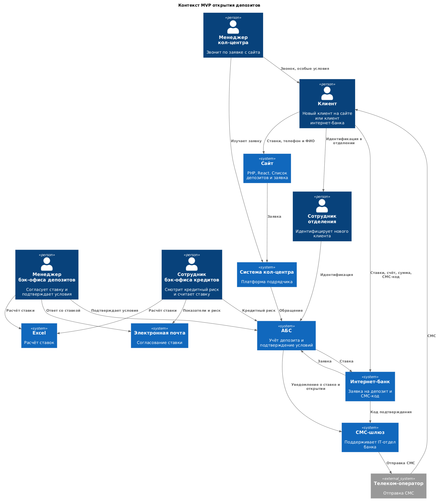
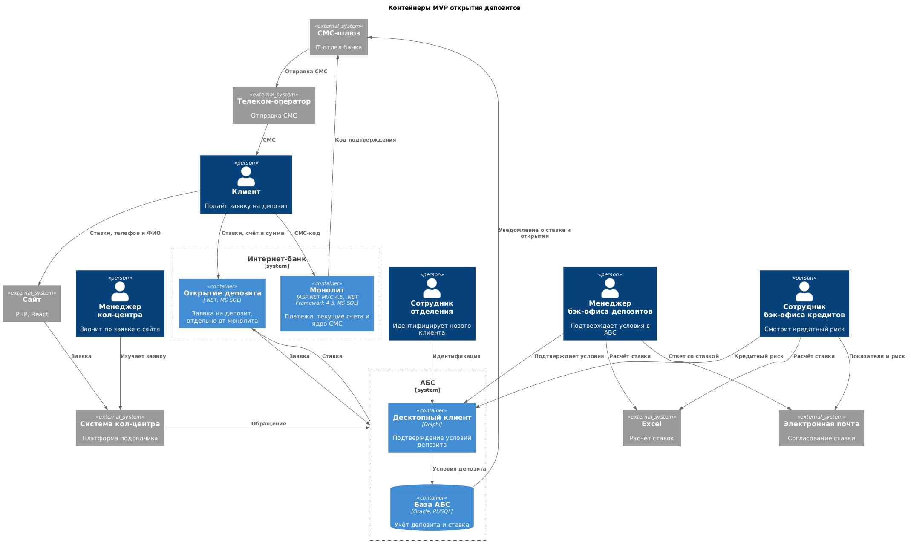

### **Название задачи:** Открытие депозитов онлайн, MVP
### **Автор:** Артур Валиуллин
### **Дата:** 05.10.2026
### **Функциональные требования**

| **№** | **Действующие лица или системы** | **Use Case** | **Описание** |
| :-: | :- | :- | :- |
| 1 | Новый клиент, сайт, система кол-центра, менеджер кол-центра, сотрудник отделения | Заявка на депозит с сайта | 1. Новый клиент видит на сайте список депозитов с актуальными ставками. 2. Оставляет телефон и ФИО. 3. Заявка попадает в систему кол-центра. 4. Менеджер звонит и может предложить особые условия. 5. После звонка новый клиент проходит идентификацию в отделении. |
| 2 | Клиент, интернет-банк | Заявка на депозит в интернет-банке | 1. Клиент видит актуальные и персональные ставки. 2. Указывает счёт и сумму. 3. Подтверждает заявку СМС-кодом из ядра интернет-банка. |
| 3 | Менеджер бэк-офиса депозитов, сотрудник бэк-офиса кредитов, Excel, электронная почта, АБС, клиент | Согласование ставки и открытие депозита | 1. Ставки сейчас ведутся в Excel. С ними работают бэк-офис депозитов и бэк-офис кредитов, данные друг друга им недоступны. 2. Согласование идёт текущим путём: кредитный риск смотрят в АБС, данные передают по почте, ставку считают в Excel. 3. Менеджер бэк-офиса подтверждает условия в АБС. 4. Клиент получает СМС после подтверждения ставки и после открытия депозита. 5. Вынести ставки и текущий процесс согласования в АБС в требованиях указано как возможность. |

### **Нефункциональные требования**

| **№** | **Требование** |
| :-: | :- |
| 1 | Интерфейс работы удобный для клиента. Цвета и элементы интерфейса берутся из дизайн-системы банка. |
| 2 | Сервисы работают 24/7 и доступны в 99,9% случаев, в том числе интернет-банк при сбое основного ЦОД и при требуемой нагрузке. Сейчас интернет-банк стоит в одном ЦОД на одной группе серверов, и его команда считает это требование пока невыполнимым. Резервный ЦОД у банка есть, на него можно переключиться. |
| 3 | Нужно равномерное горизонтальное масштабирование и распределение запросов между серверами, приложениями и ЦОД. АБС из-за базы масштабируется только вертикально. |
| 4 | Онлайн-заявки не должны ставить под угрозу АБС: база уже перегружена. Прямой работы интернет-банка с API АБС в новом процессе лучше избежать. |
| 5 | Отклик по всем операциям должен быть в миллисекундах. Справочные данные, которые при платежах загружаются дольше секунды, нужно отдавать быстрее. |
| 6 | Доработки на технологиях, которые уже есть в банке, например MS SQL и Oracle. Новую технологию можно взять, если она совместима с текущими платформами и в банке уже есть экспертиза хотя бы на уровне языка. |
| 7 | Если нужны очереди, лучше Kafka. Текущая версия платформы интернет-банка с ней несовместима. |
| 8 | Перевод интернет-банка на микросервисы только в рамках открытия депозитов. Для дальнейшего расширения нужна документация. |
| 9 | СМС-функционал ядра дорабатывает команда банка, без доработки подрядчика. |
| 10 | В объёме только MVP. Заявку на депозит обрабатывает менеджер бэк-офиса и подтверждает условия в АБС. |
| 11 | Нового клиента нельзя принять без личной проверки документов в отделении. |
| 12 | Чувствительные данные с сайта и данные интернет-банка при передаче защищаются шифрованием трафика. |

### **Решение**
Диаграмма контекста.

Диаграмма контейнеров. Раскрыты интернет-банк и АБС.

Интернет-банк остаётся на ASP.NET MVC 4.5, .NET Framework 4.5 и MS SQL. Монолит закрывает платежи, текущие счета и ядро СМС. Открытие депозита выделено отдельно: перевод на микросервисы ограничен этой задачей. Отдельный контур на .NET и MS SQL. СМС-код подтверждения дорабатывает команда интернет-банка, 10 человек. Подрядчика ядра, ещё 10 человек, для этого не привлекают. Код уходит в СМС-шлюз, который поддерживает IT-отдел, и дальше телеком-оператору.

АБС остаётся системой своей команды из 20 человек: десктопный клиент на Delphi и база Oracle с логикой на PL/SQL. Менеджер бэк-офиса подтверждает условия в этом клиенте. Уведомления о ставке и об открытии депозита отправляет АБС через тот же СМС-шлюз.

Сайт на PHP и React, собственная разработка банка. Заявка с телефона и ФИО попадает в систему кол-центра. Платформу сопровождает подрядчик, 5 человек. Точечные изменения на Java по просьбе бизнеса могут делать специалисты команды АБС. Дальше обращение передаётся в АБС, как в текущем процессе кол-центра.

Ставки считают в Excel. Кредитный риск смотрят в АБС, обмен между бэк-офисом депозитов и бэк-офисом кредитов идёт по почте, доступ к данным друг друга им закрыт. Связь интернет-банка с АБС на схемах подписана как заявка и ставка. Прямой вызов API АБС из интернет-банка не используется. Трафик сайта и интернет-банка шифруется.

Доступность 99,9% при сбое ЦОД для интернет-банка в одном ЦОД на одной группе серверов команда считает пока невыполнимой. Резервный ЦОД есть. АБС из-за базы масштабируется только вертикально, онлайн-заявки её не нагружают.

### **Альтернативы**
- Прямой API интернет-банка к АБС. Команда АБС указывает на перегруженную базу и просит в новом процессе такой работы избежать.
- Прямое чтение базы АБС, как сейчас сделано для платежей интернет-банка. Нагрузка приходится на ту же базу.
- Kafka из текущего монолита интернет-банка. Если очереди нужны, Kafka предпочтительна, но текущая версия платформы интернет-банка с ней несовместима.
- Доработка СМС-функционала ядра подрядчиком интернет-банка. Этот функционал дорабатывает команда банка.
- Перевод всего интернет-банка на микросервисы. Такой перевод ограничен задачей открытия депозитов.
- Автоматическое открытие депозита без сотрудника бэк-офиса. Это цель на год. В MVP условия подтверждает менеджер бэк-офиса в АБС.

**Недостатки, ограничения, риски**

- Команда интернет-банка считает требование 99,9% и доступности при сбое ЦОД пока невыполнимым: система стоит в одном ЦОД на одной группе серверов. Переключение на резервный ЦОД возможно.
- База АБС уже перегружена. Онлайн-заявки не должны ставить под угрозу работоспособность банка. АБС масштабируется только вертикально.
- Способ передачи заявки и ставки между интернет-банком и АБС в исходных данных не задан. Прямой API для нового процесса не подходит.
- Ядро интернет-банка обновляет подрядчик. Платформу кол-центра сопровождает другой подрядчик.
- Сотрудники депозитов и сотрудники кредитов не должны иметь доступа к данным друг друга.
- Новый клиент не открывает депозит полностью онлайн: после заявки с сайта нужна личная проверка документов в отделении.
