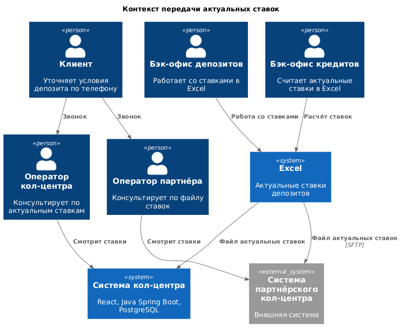
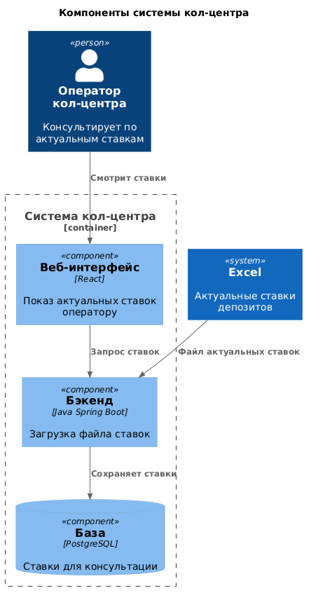

### **Название задачи:** Передача актуальных ставок в кол-центр
### **Автор:** Артур Валиуллин
### **Дата:** 05.10.2026
### **Функциональные требования**

| **№** | **Действующие лица или системы** | **Use Case** | **Описание** |
| :-: | :- | :- | :- |
| 1 | Клиент, оператор кол-центра, система кол-центра | Консультация по актуальным ставкам | 1. Клиент звонит и уточняет условия открытия депозита. 2. Оператор открывает актуальные ставки в системе кол-центра. 3. Оператор называет клиенту текущие ставки банка. |
| 2 | Клиент, оператор партнёрского кол-центра, система партнёра | Консультация партнёра по файлу ставок | 1. Клиент звонит в партнёрский кол-центр. 2. Оператор смотрит актуальные ставки, которые партнёр получил файлом. 3. Оператор называет клиенту эти ставки. |
| 3 | Бэк-офис депозитов, бэк-офис кредитов, Excel, система кол-центра, система партнёра | Передача актуальных ставок | 1. Актуальные ставки по-прежнему считают в Excel. С файлом работают бэк-офис депозитов и бэк-офис кредитов. 2. Файл актуальных ставок попадает в систему кол-центра банка. 3. Тот же файл уходит партнёру. API-вызова в систему партнёра нет, передача идёт файлом по SFTP. |

### **Нефункциональные требования**

| **№** | **Требование** |
| :-: | :- |
| 1 | Партнёрский кол-центр работает во внешней системе. Сотрудники партнёра получают актуальные ставки файлом. API-вызовов в эту систему нет. Передача файла идёт по SFTP. |
| 2 | Источник актуальных ставок - текущий процесс: Excel, ежедневный пересчёт, бэк-офис депозитов и бэк-офис кредитов. |
| 3 | Сотрудники депозитов и сотрудники кредитов не имеют доступа к данным друг друга. В кол-центр уходит список актуальных ставок, а не кредитный риск клиента. |
| 4 | Систему кол-центра банка сопровождает подрядчик. Точечные изменения на Java по просьбе бизнеса могут делать специалисты команды АБС. |

### **Решение**
Диаграмма контекста.

Диаграмма компонентов системы кол-центра банка.

Актуальные ставки остаются в Excel. Их по-прежнему считают сотрудники бэк-офиса кредитов и с ними работают сотрудники бэк-офиса депозитов.

Система кол-центра банка получает этот файл и показывает ставки оператору. У системы уже есть веб-интерфейс на React, бэкенд на Java Spring Boot и база PostgreSQL. Файл загружает бэкенд, ставки лежат в существующей PostgreSQL, оператор видит их в веб-интерфейсе. Платформу сопровождает подрядчик. Точечную доработку на Java могут сделать специалисты команды АБС.

Партнёрский кол-центр внешний. Тот же файл актуальных ставок передаётся ему по SFTP. Сотрудник партнёра консультирует клиента по полученному файлу. Своя система кол-центра и система партнёра этот файл только читают.

Рост звонков после маркетинговой кампании закрывается подключением партнёрского кол-центра к тем же актуальным ставкам.

### **Альтернативы**
- API в систему партнёрского кол-центра. Партнёр готов получать ставки файлом, API-вызовов в его систему нет.
- Отдельный API ставок в АБС вместо текущего Excel. Сейчас актуальные ставки ведутся в Excel, и этот кейс опирается на текущий процесс.
- Рассылка актуальных ставок операторам по почте. Задание требует доступ системы кол-центра к ставкам и файл для партнёра.

**Недостатки, ограничения, риски**

- После маркетинговой кампании звонков станет больше. Свой кол-центр может быть перегружен, поэтому к консультации подключается партнёр.
- Партнёр внешний и принимает только файл. Актуальные ставки у него появляются после передачи файла, а не онлайн-вызовом.
- Ставки в Excel обновляют ежедневно. Файл для кол-центров следует этому же ритму.
- Платформу кол-центра банка сопровождает подрядчик.

### **Крупные задачи**

| **Система** | **Задача** | **Горизонт** |
| :- | :- | :- |
| Excel | T1. Отдать файл актуальных ставок из текущего процесса. | 6 месяцев |
| Система кол-центра | T2. Загрузить файл и показать ставки оператору. | 6 месяцев |
| Система кол-центра | T3. Принимать заявку на депозит с сайта. | 6 месяцев |
| Система партнёрского кол-центра | T4. Получить файл по SFTP и показать ставки оператору. | 6 месяцев |
| Сайт | T5. Показать список депозитов и принять заявку с телефона и ФИО. | 6 месяцев |
| Интернет-банк | T6. Сделать СМС-код в ядре силами команды банка. | 6 месяцев |
| Интернет-банк | T7. Открыть приём депозита: ставки, счёт и сумма, в отдельном контуре на .NET и MS SQL. | 6 месяцев |
| АБС | T8. Подтверждать условия депозита менеджером бэк-офиса и отправлять СМС после ставки и после открытия. | 6 месяцев |
| Интернет-банк | T9. Открывать депозит без участия бэк-офиса. | Год |
| АБС | T10. Проводить открытие депозита без бэк-офиса. В отделении остаётся только фронт-офис. | Год |

Порядок на горизонте 6 месяцев: T1 раньше T2 и T4. T3, T5, T6, T7 и T8 идут в том же горизонте. T9 и T10 стоят на горизонте года, после MVP. Схема последовательности: [roadmap.drawio](roadmap.drawio).
