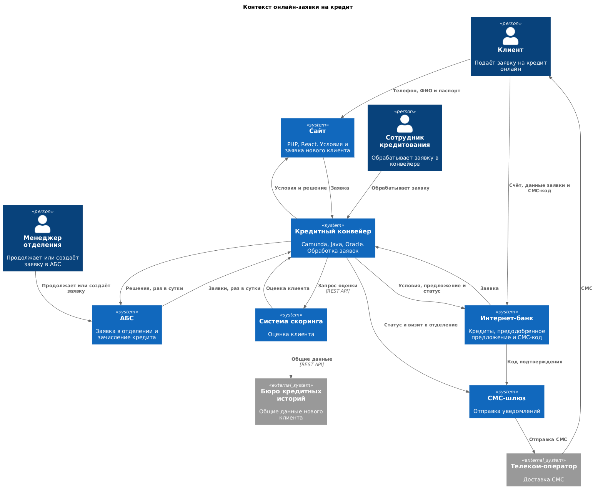
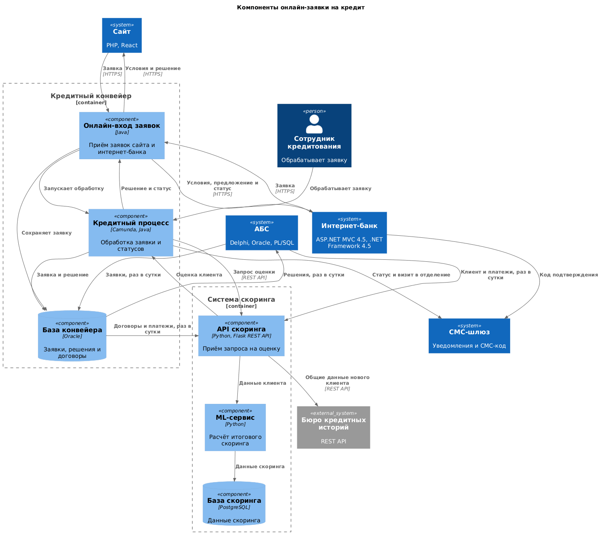

### **Название задачи:** Заявка на кредит онлайн
### **Автор:**
### **Дата:** 05.10.2026
### **Функциональные требования**

| **№** | **Действующие лица или системы** | **Use Case** | **Описание** |
| :-: | :- | :- | :- |
| 1 | Новый клиент, сайт, кредитный конвейер, скоринг, бюро кредитных историй, СМС-шлюз | Заявка на кредит с сайта | 1. Новый клиент видит предложение по условиям из кредитного конвейера. 2. Оставляет телефон и ФИО. 3. Если клиент указал паспорт, конвейер запрашивает немедленное решение скоринга. Для нового клиента используются только общие данные бюро кредитных историй. 4. Клиент получает решение и СМС о визите в отделение для получения кредита и идентификации. |
| 2 | Клиент, менеджер отделения, АБС | Продолжение заявки в отделении | 1. Клиент приходит в отделение. 2. Если предварительное одобрение уже получено на сайте, менеджер продолжает ту же заявку через АБС. 3. Для полностью нового клиента менеджер создаёт новую заявку. |
| 3 | Клиент интернет-банка, интернет-банк, кредитный конвейер, скоринг, СМС-шлюз | Заявка на кредит в интернет-банке | 1. Клиент видит список кредитов с актуальными условиями и предодобренное предложение, если оно рассчитано. 2. Указывает счёт зачисления и данные заявки. 3. Подтверждает отправку СМС-кодом. 4. Если ситуация изменилась, скоринг повторяется по упрощённой процедуре. 5. Клиент получает СМС при изменении статуса заявки. |
| 4 | Сотрудник кредитования, кредитный конвейер | Обработка предодобренной заявки | 1. Заявка сразу попадает в кредитный конвейер. 2. Сотрудник обрабатывает её в течение того же рабочего дня. 3. Решение передаётся в АБС существующим суточным обменом. |

### **Нефункциональные требования**

| **№** | **Требование** |
| :-: | :- |
| 1 | Интерфейс удобный для клиента. Цвета и элементы интерфейса берутся из дизайн-системы банка. |
| 2 | Сервисы работают 24/7 и доступны в 99,9% случаев. Интернет-банк должен оставаться доступным при сбое основного ЦОД и выдерживать требуемую нагрузку. |
| 3 | Кредитный конвейер и скоринг поддерживают горизонтальное масштабирование и работу 24/7. |
| 4 | Отклик операций занимает миллисекунды. |
| 5 | Скоринг в рабочие часы не нагружается дополнительными процессами предрасчёта. |
| 6 | База АБС уже перегружена и масштабируется только вертикально. Интернет-банк не работает напрямую с API АБС в новом процессе. |
| 7 | Обмен между базами АБС и кредитного конвейера нельзя ускорить или проводить чаще раза в сутки. |
| 8 | Доработки используют существующие технологии банка. Новая технология допустима только при совместимости с текущими платформами и наличии экспертизы в банке. |
| 9 | СМС-функционал ядра интернет-банка дорабатывает команда банка без доработки подрядчика. |
| 10 | Чувствительные данные сайта и данные интернет-банка при передаче защищаются шифрованием трафика. |

### **Решение**
Диаграмма контекста.

Диаграмма компонентов кредитного решения.

В кредитном конвейере добавляется онлайн-вход заявок на Java рядом с существующим процессом Camunda и базой Oracle. Сайт и интернет-банк передают заявки в конвейер, не обращаясь к перегруженной АБС. Полные условия кредита сайт и интернет-банк получают из конвейера.

Онлайн-вход сохраняет заявку в Oracle и запускает процесс Camunda. Поэтому сайт, интернет-банк и сотрудники кредитования работают с одной заявкой. Конвейер вызывает существующий REST API скоринга. Скоринг использует Flask, внутренний ML-сервис и PostgreSQL. Запрос к бюро кредитных историй выполняется онлайн по REST API. Для нового клиента сайта используются только общие данные бюро.

Предодобренные предложения рассчитываются вне рабочих часов. После подачи заявки скоринг при необходимости повторяется по упрощённой процедуре. Так скоринг не получает дополнительную нагрузку от предрасчётов в рабочее время.

Суточный обмен АБС и кредитного конвейера сохраняется. После обмена менеджер отделения продолжает в АБС заявку, уже созданную на сайте. Для клиента без заявки менеджер создаёт новую. Решения из конвейера также передаются в АБС раз в сутки.

СМС-код для интернет-банка реализуется в существующем ядре силами команды банка. Кредитный конвейер отправляет через существующий СМС-шлюз уведомления о визите в отделение и об изменении статуса заявки.

Новые технологии не вводятся. Конвейер остаётся на Java, Camunda и Oracle. Скоринг остаётся на Python, Flask и PostgreSQL с существующим ML-сервисом.

### **Альтернативы**
- Оставить передачу всех онлайн-заявок через АБС и суточный обмен. Этот путь не позволяет немедленно принять заявку сайта и обработать предодобренную заявку в тот же рабочий день, а база АБС уже перегружена.
- Направлять сайт прямо в скоринг без кредитного конвейера. Скоринг возвращает оценку, но не ведёт кредитную заявку, которую должен продолжить сотрудник.
- Направлять интернет-банк прямо в АБС. Это создаёт дополнительную нагрузку на АБС и противоречит требованию избегать прямой работы интернет-банка с её API.
- Выполнять предрасчёт предложений в рабочие часы. Скоринг критичен для банка и уже испытывает повышенную нагрузку в это время.

**Недостатки, ограничения, риски**

- Заявка и решение появляются в АБС только после суточного обмена с кредитным конвейером. Ускорить этот обмен нельзя.
- Новый клиент после заявки с сайта проходит идентификацию в отделении.
- Скоринг критичен для банка и испытывает повышенную нагрузку в рабочие часы.
- База АБС перегружена и масштабируется только вертикально.
- Интернет-банк сейчас работает в одном ЦОД на одной группе серверов. Его команда считает требование 99,9% и доступности при сбое ЦОД пока невыполнимым. У банка есть резервный ЦОД для переключения.
